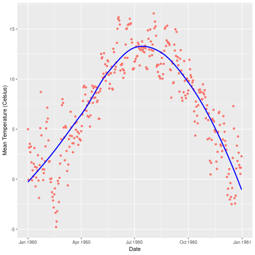
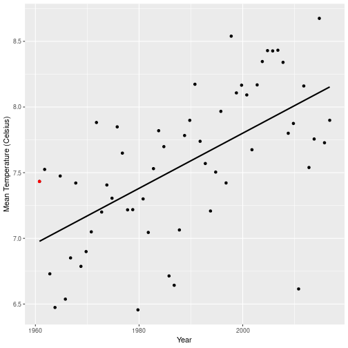

Scotland Climate Explorer
========================================================
author: Greg Sutcliffe
date: 13th October 2018
autosize: true

Concept
========================================================

This app is intended to allow exploration of Scotland's
climate.

Currently, it provides insights into the temperature and
rainfall in the vicinity of Crieff, Scotland, since 1960.

The app allows the user to select a year, and displays
temperature & rainfall data per day for that years, as
well as highlighting the selected year on a graph of the
mean values for all years.

This enables the user to see the characteristics for the
selected year, as well as how the selected year compares
to the years around it, and the predicted values for the
selected year.

Sample Daily Graph
========================================================

Here is the mean temperate per day for 1960

Sample All-Years Graph
========================================================

Here is a sample graph of all years, highlighting 1960 in red

Potential Expansions
====================

It's natural to want to compare one year to the year before,
and the after. It would be good to add comparisons to the
surrounding years in some way - possibly using a 3-pane format,
or maybe a ridgeplot.

More variables would also be interesting to explore - hours of
sunlight, cloud cover, and wind speed could all be added.
